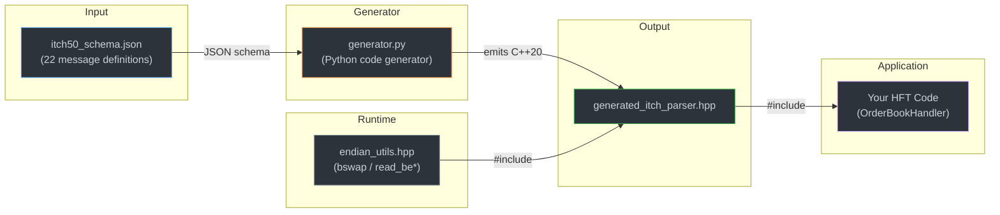
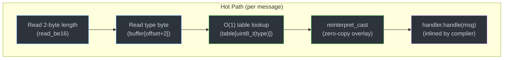

# HFT ITCH 5.0 Parser Generator

**Zero-copy, zero-allocation, schema-driven NASDAQ ITCH 5.0 parser generator for high-frequency trading systems.**

Built with C++20 concepts, `constexpr` dispatch tables, and compiler-verified codegen — designed for nanosecond-scale market data parsing on the hot path.

---

## 📋 Table of Contents

- [Key Features](#-key-features)
- [Architecture Overview](#-architecture-overview)
- [Performance](#-performance)
- [Quick Start](#-quick-start)
- [Usage Examples](#-usage-examples)
- [Schema Format](#-schema-format)
- [Assembly Verification](#-assembly-verification)
- [Project Structure](#-project-structure)
- [Message Types](#-message-types)
- [Building & Testing](#-building--testing)
- [Design Decisions](#-design-decisions)
- [License](#-license)

---

## ⚡ Key Features

| Feature | Description |
|---|---|
| **Zero-Copy Parsing** | Structs overlay directly onto the network buffer via `reinterpret_cast` — no memcpy, no deserialization |
| **Zero-Allocation** | No heap allocations on the hot path. Alpha fields return `std::string_view` into the source buffer |
| **Schema-Driven** | All 22 message types generated from a single JSON schema — change the schema, regenerate the parser |
| **C++20 Concepts** | `CanHandle<Handler, Message>` concept enables compile-time handler dispatch — unhandled messages are eliminated at compile time |
| **Assembly-Verified** | Godbolt-ready snippet proves the parser compiles to `movbe` instructions with zero branches |
| **`constexpr` Everything** | Message size lookup, name lookup, and dispatch tables are all `constexpr` |
| **Header-Only** | Single generated header + one utility header — drop into any project |
| **HFT-Grade Flags** | `-fno-exceptions -fno-rtti -O3 -march=native -flto` by default |

---

## 🏗️ Architecture Overview



The generator reads the JSON schema and emits:

1. **`#pragma pack(push, 1)` structs** — exact wire-layout fields with zero padding
2. **Inline accessor methods** — endian-aware for integers, `std::string_view` for alpha fields, `_double()` helpers for price fields
3. **`static_assert(sizeof(T) == N)`** — compile-time wire size verification for every struct
4. **`constexpr message_size()` / `message_name()`** — O(1) lookup functions
5. **`CanHandle` concept + `dispatch_message` + `DispatchTable`** — three dispatch strategies at different abstraction levels
6. **`parse_stream()`** — MoldUDP64 stream parser with length-prefix framing

---

## 🚀 Performance

### Why This Parser Is Fast



#### `movbe` Codegen

On x86-64 with `-march=native`, the compiler fuses `memcpy` + `bswap` into a single **`movbe`** (move big-endian) instruction. Reading a 64-bit order reference number compiles to:

```asm
movbe  rax, QWORD PTR [rdi+11]    ; load + byte-swap in one instruction
```

No intermediate copies. No function calls. One cycle.

#### O(1) Dispatch Table

The `DispatchTable<Handler>` creates a 256-entry function pointer array at compile time. Message dispatch is a single indexed load — no switch, no bounds check, no branch:

```cpp
table[static_cast<uint8_t>(type)](handler, buffer);  // one indirect call
```

#### Compile-Time Dead Code Elimination

The `CanHandle<Handler, Message>` C++20 concept detects which `handle()` overloads your handler provides. If your handler only handles `AddOrder` and `OrderExecuted`, the compiler eliminates all other dispatch branches entirely — they never exist in the binary.

#### HFT Compiler Flags

| Flag | Rationale |
|---|---|
| `-fno-exceptions` | Exceptions add hidden control flow, RTTI metadata, and unwind tables — latency poison |
| `-fno-rtti` | Eliminates `type_info` vtable overhead on every polymorphic type |
| `-O3` | Full optimization including auto-vectorization and aggressive inlining |
| `-march=native` | Enables `movbe`, `bmi2`, and other microarchitecture-specific instructions |
| `-flto` | Link-time optimization across translation units |

### Limit Order Book Throughput

The LOB benchmark suite (`itch_lob_bench`) measures per-operation latency on a pre-warmed 100-level book:

```bash
./build/itch_lob_bench
```

| Benchmark | What it measures |
|---|---|
| `BM_LOB_AddOrder` | Insert into a 100-level book |
| `BM_LOB_AddDeleteCycle` | Add + delete round-trip |
| `BM_LOB_ExecuteOrder` | Add + full fill execution |
| `BM_LOB_ReplaceOrder` | Order replacement (delete old + insert new) |
| `BM_LOB_MixedWorkload` | Realistic 40/30/15/10/5 message mix |
| `BM_LOB_EndToEnd` | Full pipeline: parse ITCH stream → dispatch → LOB update |

---

## 🏁 Quick Start

### Prerequisites

- **C++20 compiler** — GCC 13+ or Clang 18+
- **CMake** ≥ 3.22
- **Python 3** — for the code generator (optional if using pre-generated header)

### Native Linux Build

```bash
# Clone the repository
git clone https://github.com/your-username/hft-parser-generator.git
cd hft-parser-generator

# Configure and build (Release mode is default)
cmake -B build -DCMAKE_BUILD_TYPE=Release
cmake --build build -j$(nproc)

# Run tests
./build/itch_tests

# Run benchmarks
./build/itch_bench

# Run the integration driver
./build/itch_driver
```

### Docker (Windows / Cross-Platform)

For Windows users or reproducible builds, use the included Docker environment:

```powershell
# One-command build + test
.\test_in_docker.ps1
```

Or manually via Docker Compose:

```bash
# Start an interactive shell in the build environment
docker-compose run --rm hft-env

# Inside the container:
cmake -B build -DCMAKE_BUILD_TYPE=Release
cmake --build build -j$(nproc)
./build/itch_tests
./build/itch_bench
```

The Docker image is based on Ubuntu 24.04 and includes GCC 13, Clang 18, CMake, GTest, Google Benchmark, Valgrind, and perf tools.

---

## 💻 Usage Examples

### 1. Run the Code Generator

Regenerate the parser header from the schema:

```bash
python3 generator/generator.py schema/itch50_schema.json generated/generated_itch_parser.hpp
```

Or via CMake (if Python3 is available):

```bash
cmake --build build --target generate
```

### 2. Define a Handler (Only Handle What You Need)

The parser uses a **handler pattern** with the `CanHandle` C++20 concept. Only implement `handle()` overloads for the message types you care about — everything else is eliminated at compile time:

```cpp
#include "generated_itch_parser.hpp"
using namespace itch50;

struct OrderBookHandler {
    uint64_t add_count = 0;
    uint64_t exec_count = 0;

    void handle(const AddOrder& msg) {
        add_count++;
        // Zero-copy access — no parsing overhead
        auto ref   = msg.order_reference_number();  // uint64_t, endian-swapped
        auto stock = msg.stock_trimmed();            // string_view, no allocation
        auto side  = msg.buy_sell_indicator();       // char
        auto qty   = msg.shares();                   // uint32_t
        auto px    = msg.price_double();             // double (4 implied decimals)
    }

    void handle(const OrderExecuted& msg) {
        exec_count++;
        auto shares = msg.executed_shares();
        auto match  = msg.match_number();
    }
    // No need to handle the other 20 message types — they compile away
};
```

### 3. Direct Cast (Lowest Level)

When you know the message type ahead of time:

```cpp
// Overlay directly onto a network buffer — zero copies
auto* msg = reinterpret_cast<const AddOrder*>(buffer);
uint64_t ref = msg->order_reference_number();  // single movbe instruction
```

### 4. Switch-Based Dispatch (`dispatch_message`)

For moderate flexibility with excellent branch prediction:

```cpp
OrderBookHandler handler;
// type = first byte of the ITCH message
bool handled = dispatch_message(handler, type, buffer);
```

Uses a `switch` statement with `if constexpr (CanHandle<...>)` checks — unhandled branches are removed at compile time.

### 5. O(1) Dispatch Table (`DispatchTable`)

For absolute lowest latency — one indirect function call, no branching:

```cpp
OrderBookHandler handler;
DispatchTable<OrderBookHandler> table;  // constexpr, 256 function pointers
table.dispatch(handler, type, buffer);  // O(1) indexed lookup
```

### 6. MoldUDP64 Stream Parsing (`parse_stream`)

For processing a contiguous buffer of length-prefixed ITCH messages:

```cpp
OrderBookHandler handler;
// buffer contains: [2B length][message][2B length][message]...
size_t bytes_consumed = parse_stream(handler, buffer, buffer_length);
```

---

## 📐 Schema Format

The parser is generated from `schema/itch50_schema.json`. The schema is self-documenting and follows this structure:

### Top-Level Properties

```json
{
  "protocol": "NASDAQ TotalView-ITCH 5.0",
  "version": "5.0",
  "byte_order": "big_endian",
  "data_types": { ... },
  "messages": [ ... ]
}
```

### Data Types

The `data_types` section defines the mapping from schema types to C++ types:

| Schema Type | C++ Storage | Size | Endian Swap | Description |
|---|---|---|---|---|
| `alpha` | `char` | 1 | No | Single ASCII character |
| `alpha_2` | `char[2]` | 2 | No | Fixed 2-byte string (space-padded) |
| `alpha_4` | `char[4]` | 4 | No | Fixed 4-byte string (space-padded) |
| `alpha_8` | `char[8]` | 8 | No | Fixed 8-byte string (space-padded) |
| `integer_2` | `uint16_t` | 2 | Yes | Big-endian 16-bit unsigned |
| `integer_4` | `uint32_t` | 4 | Yes | Big-endian 32-bit unsigned |
| `integer_6` | `uint8_t[6]` | 6 | Yes | 48-bit timestamp (nanoseconds since midnight) |
| `integer_8` | `uint64_t` | 8 | Yes | Big-endian 64-bit unsigned |
| `price_4` | `uint32_t` | 4 | Yes | 32-bit price (4 implied decimals) |
| `price_8` | `uint64_t` | 8 | Yes | 64-bit price (8 implied decimals) |

### Message Definition

Each message in the `messages` array looks like:

```json
{
  "type": "A",
  "name": "AddOrder",
  "size": 36,
  "category": "order",
  "description": "...",
  "fields": [
    { "name": "message_type",           "type": "alpha",     "offset": 0,  "length": 1, "value": "A" },
    { "name": "stock_locate",           "type": "integer_2", "offset": 1,  "length": 2 },
    { "name": "tracking_number",        "type": "integer_2", "offset": 3,  "length": 2 },
    { "name": "timestamp",              "type": "integer_6", "offset": 5,  "length": 6 },
    { "name": "order_reference_number", "type": "integer_8", "offset": 11, "length": 8 },
    { "name": "buy_sell_indicator",     "type": "alpha",     "offset": 19, "length": 1 },
    { "name": "shares",                 "type": "integer_4", "offset": 20, "length": 4 },
    { "name": "stock",                  "type": "alpha_8",   "offset": 24, "length": 8 },
    { "name": "price",                  "type": "price_4",   "offset": 32, "length": 4 }
  ]
}
```

### Extending the Schema

To add a new message type:

1. Add a new entry to the `messages` array with `type`, `name`, `size`, `category`, and `fields`
2. Ensure `offset` and `length` values are contiguous and sum to `size`
3. Run the generator: `python3 generator/generator.py schema/itch50_schema.json generated/generated_itch_parser.hpp`
4. The generator will emit the new struct, accessors, `static_assert`, dispatch cases, and `DispatchTable` entries automatically

---

## 🔬 Assembly Verification

The Godbolt snippet at `godbolt/godbolt_snippet.cpp` is a self-contained, copy-pasteable file designed to verify that the parser compiles to optimal machine code.

### How to Verify

1. Open [godbolt.org](https://godbolt.org)
2. Paste the contents of `godbolt/godbolt_snippet.cpp`
3. Set compiler to **x86-64 GCC 13+** or **Clang 18+**
4. Set flags to: `-std=c++20 -O3 -march=haswell` (or `-march=native`)
5. Look at the assembly for `parse_add_order_godbolt`

### Expected Assembly Output

```asm
parse_add_order_godbolt:
        movbe   rax, QWORD PTR [rdi+11]    ; order_reference_number (8 bytes, byte-swapped)
        movbe   edx, DWORD PTR [rdi+20]    ; shares (4 bytes, byte-swapped)
        movbe   ecx, DWORD PTR [rdi+32]    ; price (4 bytes, byte-swapped)
        add     rax, rdx                    ; sum
        add     rax, rcx                    ; sum
        ret
```

### What to Look For

| Metric | Expected | Why |
|---|---|---|
| `movbe` instructions | **3** | One per field read (8B + 4B + 4B) — fused load + byte-swap |
| Branches | **0** | No conditionals in the parsing path |
| Function calls | **0** | Everything inlined — no call overhead |
| Stack usage | **0** | All register-based, no spills |

The `movbe` instruction (Move Big-Endian) performs a memory load and byte-swap in a single micro-op. Available on Haswell+ (2013). On older microarchitectures, you'll see `mov` + `bswap` pairs instead, which is still excellent.

---

## 📁 Project Structure

```
hft-parser-generator/
├── CMakeLists.txt                  # Build system — C++20, HFT flags, GTest, Google Benchmark
├── Dockerfile                      # Ubuntu 24.04 with GCC 13, Clang 18, perf, valgrind
├── docker-compose.yml              # One-command dev environment
├── test_in_docker.ps1              # PowerShell: build + test in Docker (Windows users)
│
├── schema/
│   └── itch50_schema.json          # ITCH 5.0 protocol definition (22 messages, 179 fields)
│
├── generator/
│   └── generator.py                # Python code generator (schema → C++20 header)
│
├── generated/
│   └── generated_itch_parser.hpp   # Auto-generated parser (1023 lines, 22 structs)
│
├── include/
│   ├── endian_utils.hpp            # bswap, read_be{16,32,48,64}, read_alpha
│   ├── market.hpp                  # Limit Order Book (flat sorted vector, O(1) BBO)
│   ├── moldudp64.hpp               # MoldUDP64 multicast protocol parser
│   ├── udp_receiver.hpp            # Zero-copy UDP multicast receiver
│   ├── itch_file_reader.hpp        # ITCH binary file / PCAP reader
│   └── pcap_reader.hpp             # PCAP packet parser
│
├── src/
│   ├── main.cpp                    # Integration driver with mock AddOrder message
│   ├── lob_main.cpp                # LOB reconstruction CLI (reads ITCH file → builds book)
│   ├── itch_reader_main.cpp        # ITCH file / PCAP reader CLI
│   └── live_main.cpp               # Live MoldUDP64 multicast ingestion
│
├── test/
│   └── parser_test.cpp             # GTest unit tests (struct sizes, endian, accessors)
│
├── bench/
│   ├── benchmark.cpp               # Parser benchmark (dispatch, stream parsing)
│   └── lob_benchmark.cpp           # LOB benchmark (add/delete/execute/replace/mixed/E2E)
│
└── godbolt/
    └── godbolt_snippet.cpp         # Self-contained Compiler Explorer snippet
```

---

## 📨 Message Types

All 22 ITCH 5.0 message types supported by this parser:

### System Messages

| Type | Name | Size (bytes) | Description |
|---|---|---|---|
| `S` | SystemEvent | 12 | Market/data feed handler events (start/end of day, halts) |
| `R` | StockDirectory | 39 | Active securities at start of day (symbol, tier, status) |
| `H` | StockTradingAction | 25 | Trading halt, resumption, or price indication |
| `Y` | RegSHORestriction | 20 | Reg SHO short sale circuit breaker status |
| `L` | MarketParticipantPosition | 26 | Market-maker registration status |
| `V` | MWCBDeclineLevel | 35 | Market-Wide Circuit Breaker S&P 500 thresholds |
| `W` | MWCBStatus | 12 | Circuit breaker halt status |
| `K` | IPOQuotingPeriodUpdate | 28 | IPO quoting period and price information |
| `J` | LULDAuctionCollar | 35 | Limit Up-Limit Down auction collar prices |
| `h` | OperationalHalt | 21 | Exchange-imposed operational halt |

### Order Messages

| Type | Name | Size (bytes) | Description |
|---|---|---|---|
| `A` | AddOrder | 36 | New order added to the book (no MPID) |
| `F` | AddOrderMPIDAttribution | 40 | New order with market participant ID |
| `E` | OrderExecuted | 31 | Shares executed against an existing order |
| `C` | OrderExecutedWithPrice | 36 | Execution at a price different from the order's |
| `X` | OrderCancel | 23 | Partial cancellation of an order |
| `D` | OrderDelete | 19 | Full deletion of an order from the book |
| `U` | OrderReplace | 35 | Order replaced (new ref number, shares, price) |

### Trade Messages

| Type | Name | Size (bytes) | Description |
|---|---|---|---|
| `P` | TradeNonCross | 44 | Non-cross trade execution |
| `Q` | CrossTrade | 40 | Cross trade (opening, closing, IPO, halt) |
| `B` | BrokenTrade | 19 | Previously reported trade was broken |

### Regulatory / Auction

| Type | Name | Size (bytes) | Description |
|---|---|---|---|
| `I` | NOII | 50 | Net Order Imbalance Indicator (opening/closing auction) |
| `N` | RetailInterest | 20 | Retail interest indication for a security |

---

## 🔧 Building & Testing

### CMake Options

| Option | Default | Description |
|---|---|---|
| `BUILD_TESTS` | `ON` | Build unit tests (fetches Google Test v1.15.2) |
| `BUILD_BENCHMARKS` | `ON` | Build benchmarks (fetches Google Benchmark v1.9.4) |
| `BUILD_GODBOLT` | `ON` | Build the Godbolt assembly analysis snippet |
| `CMAKE_BUILD_TYPE` | `Release` | `Release` enables `-O3 -march=native -flto` |

### Build Examples

```bash
# Full build (tests + benchmarks + godbolt)
cmake -B build -DCMAKE_BUILD_TYPE=Release
cmake --build build -j$(nproc)

# Minimal build (parser driver only)
cmake -B build -DBUILD_TESTS=OFF -DBUILD_BENCHMARKS=OFF -DBUILD_GODBOLT=OFF
cmake --build build -j$(nproc)

# Debug build (for development)
cmake -B build -DCMAKE_BUILD_TYPE=Debug
cmake --build build -j$(nproc)
```

### Running Tests

```bash
# Via CTest
cd build && ctest --output-on-failure

# Directly
./build/itch_tests
```

### Running Benchmarks

```bash
./build/itch_bench
```

### Docker Workflow

```bash
# Build the image
docker build -t hft-parser-env .

# Interactive shell
docker run --rm -it -v "$(pwd):/app" hft-parser-env

# Or use docker-compose
docker-compose run --rm hft-env
```

---

## 🧠 Design Decisions

### Why `#pragma pack(push, 1)`?

ITCH messages have no alignment padding on the wire. A 36-byte `AddOrder` message contains fields at arbitrary offsets (e.g., a `uint64_t` at offset 11). Without `#pragma pack(1)`, the compiler would insert padding to align fields to their natural boundaries, breaking the `sizeof(T) == wire_size` invariant that makes zero-copy overlay possible.

Every struct has a `static_assert` verifying its packed size matches the protocol specification.

### Why `memcpy` + `bswap` Instead of Bit Shifts?

The `read_be32` / `read_be64` functions use:
```cpp
uint64_t v;
std::memcpy(&v, p, sizeof(v));           // compiler sees this as a single load
return __builtin_bswap64(v);             // single bswap/movbe instruction
```

This is **not** a real `memcpy` — the compiler recognizes this pattern and emits a single `movbe` instruction (on Haswell+) or a `mov` + `bswap` pair. This approach:

- Avoids undefined behavior from misaligned casts
- Is endian-aware via `if constexpr (std::endian::native == std::endian::little)`
- Produces identical codegen to raw pointer casts, but is standards-compliant

### Why a Flat Sorted Array for the LOB?

The Limit Order Book uses `FlatPriceLadder<bool SortDescending>` — a contiguous `std::vector<PriceLevel>` kept sorted by price — instead of the conventional `std::map` (red-black tree).

| Property | `std::map` (RB-Tree) | `FlatPriceLadder` (Sorted Vector) |
|---|---|---|
| Memory layout | Scattered heap nodes | Contiguous array |
| Cache behavior | Pointer chasing → cache misses | Sequential → prefetcher-friendly |
| Node overhead | ~48 bytes (3 ptrs + color) | 0 bytes (just `PriceLevel`) |
| Top-of-book | O(1) via `begin()` | O(1) via `[0]` |
| Price lookup | O(log n) tree walk | O(log n) binary search |
| Insert/remove | O(log n) | O(n) memmove |

The O(n) insert/remove trade-off is worth it because:
- Active price levels per stock are typically 50–200, so memmove moves ~1–3 KB
- L1 cache is 32–64 KB; the entire ladder fits in L1
- The `static_assert(is_trivially_copyable_v<PriceLevel>)` guarantees the compiler optimizes `vector::insert/erase` to raw `memmove`
- Top-of-book access (the hottest path) is a single array dereference

### Why No Exceptions?

Exceptions add:
- **Hidden control flow** — `throw` can jump anywhere up the call stack
- **Unwind tables** — `.eh_frame` section increases binary size and can cause I-cache pressure
- **RTTI dependency** — exception matching requires runtime type identification

For HFT, the error handling strategy is: validate at the boundary (message length checks in `parse_stream`), then trust the data on the hot path. The `parse_stream` function skips incomplete messages and returns bytes consumed, allowing the caller to handle partial buffers.

### Why No RTTI?

RTTI (`-frtti`) adds a `type_info` vtable pointer to every class with virtual functions. This parser uses no virtual functions — dispatch is via `constexpr` function pointer tables and C++20 concepts. RTTI is pure overhead.

> **Note:** Google Test requires exceptions and RTTI, so the test target re-enables them with `-fexceptions -frtti` for the test binary only.

### Why Three Dispatch Strategies?

| Strategy | Mechanism | Latency | Flexibility |
|---|---|---|---|
| Direct Cast | `reinterpret_cast<const T*>(buf)` | Lowest | Caller must know the type |
| `dispatch_message()` | `switch` + `if constexpr` | Low | Automatic dead code elimination |
| `DispatchTable<H>` | 256-entry function pointer array | Lowest (for unknown types) | O(1) indexed lookup, no branch prediction |

Different parts of an HFT system have different needs. The order book hot path may use direct casts for known message types, while the feed handler loop uses `DispatchTable` for type-agnostic dispatch.

---

## 📄 License

This project is provided as-is for educational and professional use.
